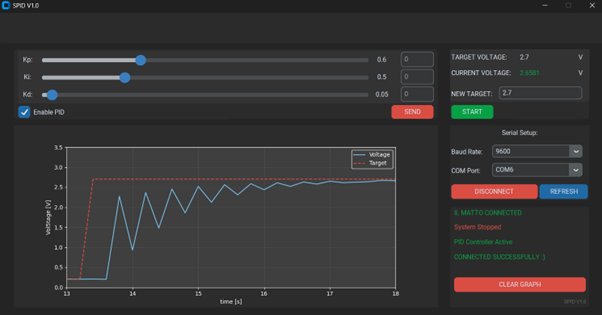

# SPID V1.0 (Serial PID Controller)

### A Voltage regulator that comes with a PID controller and is controlled by a UI on the host computer

## Introduction
This project uses an ATMega644PA as the voltage regulator. By varying the PWM duty cycle of this microcontroller and a Low Pass Filter (value used in testing were R = 100k and C = 220nF), the output voltage can be varied from 0v to 3.3v. The voltage can then be measured using the microcontroller's ADC pins and this can be used in the feedback system (PID Controller) that allows the system to self correct and maintain a target voltage. The ATMega644PA communicates with the host computer using UART (Baud Rate of 9600, No Parity, 1 Stop bit).

The UI is written with tkinter (or customtkinter to be precise) as the GUI package. The UI allows the user to select a Baud rate and COM port to then connect to the microcontroller. The user can then set a target and press START to start the microcontroller. The PID Controller can be enabled or disabled - when enabled, the user can tune the constants themself and watch the effect it has on the stability of the system by watching the graph. The graph shows two lines, the red dashed line is the target voltage chosen by the user and the solid blue line is the voltage the microcontroller measures. Upon startup, the PID constants Kp, Ki and Kd are initialised to 0.6, 0.5 and 0.05 respectively - these values offered good response times and stability during testing.

## Known Issues
The graph is quite jagged - this is because the microcontroller only sends data back roughly every 500ms. This can be sped up by modifying the code for the microcontroller. However, the faster it sends data back, the higher the chance of some data being transmitted wrong or fragmenting.

Sometimes, the graph fails to update - this is due to data that was sent being fragmented or not in the format expected. The microcontroller transmits data as "#time,voltage# and the host checks whether each line of data has 2 hashtags in it. If the data only has one or no hashtags, then the data has fragmented during transmission or some other error occured during transmission. As such, this data point is discarded and the graph seems to "miss" an update. 

Microcontroller fails to respond - this can be due to problems during transmission or the microcontroller was interuppted while reading the data. Pressing the button again usually fixes this.

## Packages Used
* customtkinter
* pyserial
* matplotlib
* numpy
* time
* threading
